# Фінальний проект

## 1. Завантажте дані:

### 1.1 Створіть схему `pandemic` у базі даних за допомогою SQL-команди.

```sql
DROP SCHEMA IF EXISTS `pandemic`;

CREATE SCHEMA `pandemic`;
```

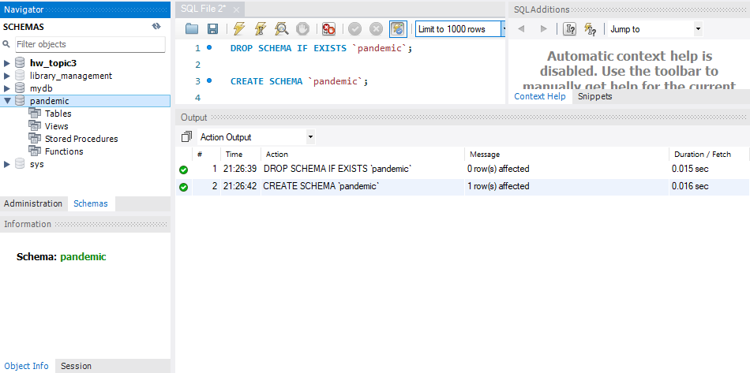

### 1.2 Оберіть її як схему за замовчуванням за допомогою SQL-команди.

```sql
USE `pandemic`;
```

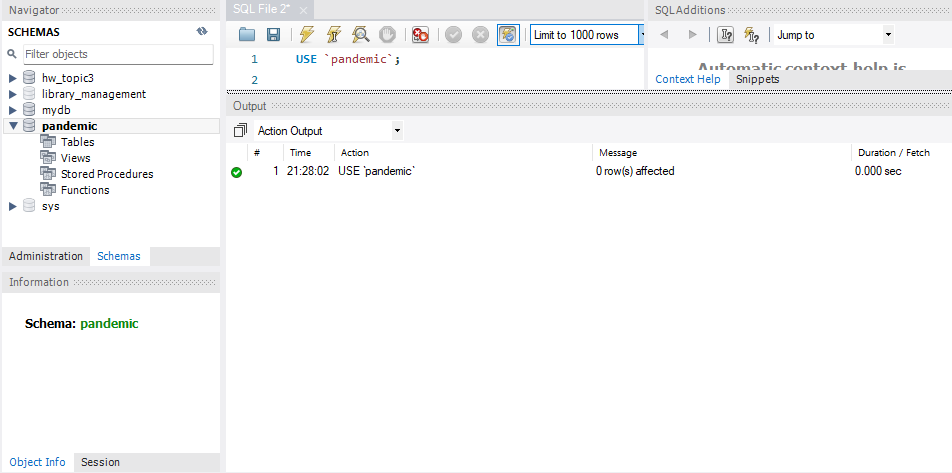

### 1.3 Імпортуйте дані за допомогою Import wizard так, як ви вже робили це у темі 3.

Приклад як мають виглядати налаштування для Table Import Wizard:

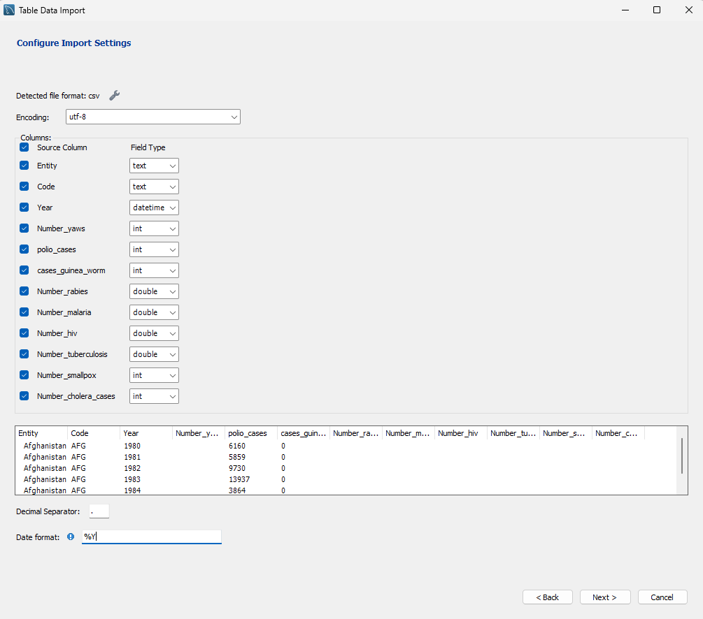

Але оскільки Table Wizard працює дуже повільно для такого великого обсягу даних,
та існує проблема з конвертації порожнього значення у числовий тип,
то краще використовувати Load Data Infile:

1. Спочатку треба створити саму таблицю перед тим, як робити імпорт:

```sql
CREATE TABLE infectious_cases (
    entity VARCHAR(255),
    code VARCHAR(255),
    year YEAR,
    number_yaws INT NULL,
    polio_cases INT NULL,
    cases_guinea_worm INT NULL,
    number_rabies FLOAT NULL,
    number_malaria FLOAT NULL,
    number_hiv FLOAT NULL,
    number_tuberculosis FLOAT NULL,
    number_smallpox INT NULL,
    number_cholera_cases INT NULL
);
```

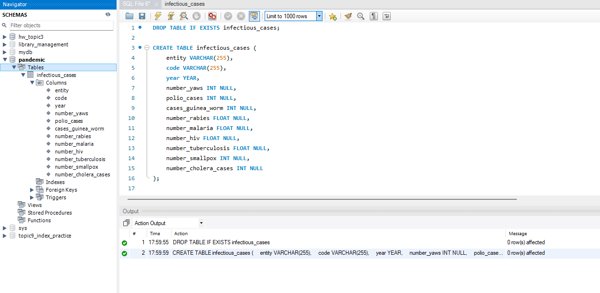

2. Потім за допомогою Load Data Infile імпортуємо дані з CSV файлу до таблиці `infectious_cases`:

```sql
-- Ця опція вмикає дозвіл на завантаження даних з файлу
SET GLOBAL local_infile = 1;

-- Імпортування даних з CSV файлу до таблиці `infectious_cases`
LOAD DATA INFILE 'C:/ProgramData/MySQL/MySQL Server 8.0/Uploads/infectious_cases.csv'
INTO TABLE `pandemic`.`infectious_cases`
FIELDS TERMINATED BY ','
ENCLOSED BY '"'
LINES TERMINATED BY '\n'
IGNORE 1 ROWS
(
    entity, code, year, @v_yaws, @v_polio, @v_guinea, @v_rabies, @v_malaria,
    @v_hiv, @v_tuberculosis, @v_smallpox, @v_cholera
)
SET
    -- Обробляємо всі числові поля, перетворюючи порожні рядки на NULL
    number_yaws = NULLIF(@v_yaws, ''),
    polio_cases = NULLIF(@v_polio, ''),
    cases_guinea_worm = NULLIF(@v_guinea, ''),
    number_rabies = NULLIF(@v_rabies, ''),
    number_malaria = NULLIF(@v_malaria, ''),
    number_hiv = NULLIF(@v_hiv, ''),
    number_tuberculosis = NULLIF(@v_tuberculosis, ''),
    number_smallpox = NULLIF(@v_smallpox, ''),
    number_cholera_cases = NULLIF(@v_cholera, '');
```

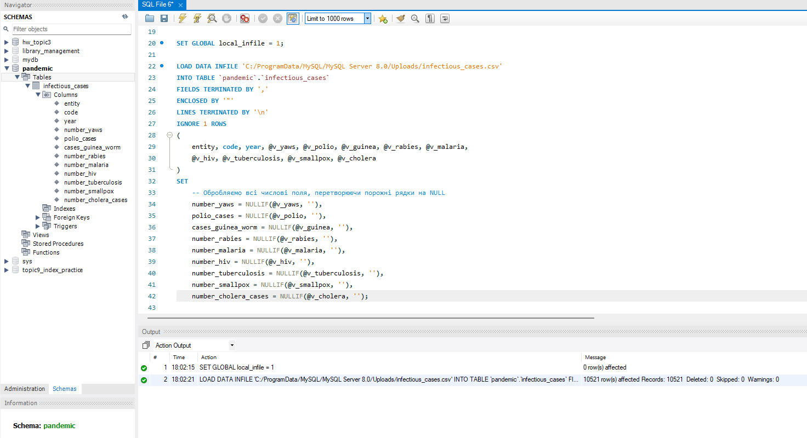

### 1.4 Продивіться дані, щоб бути у контексті.

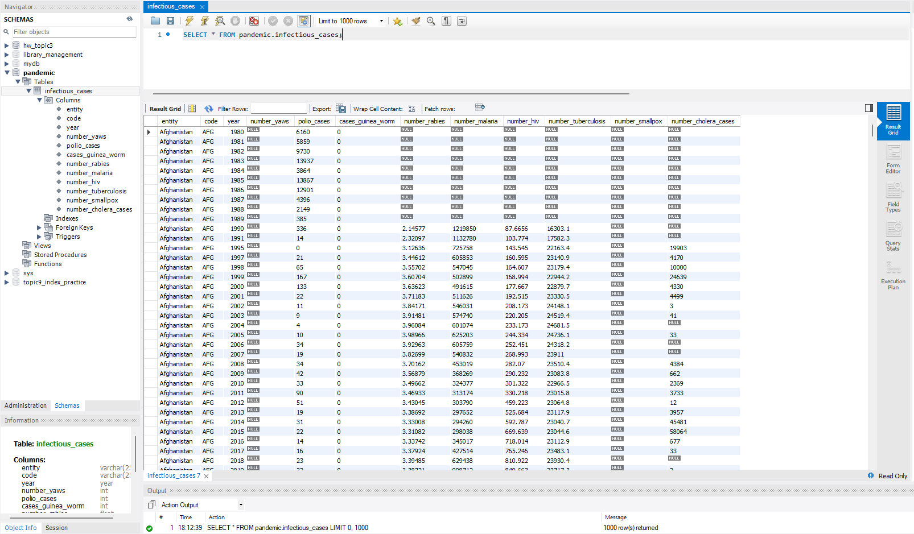

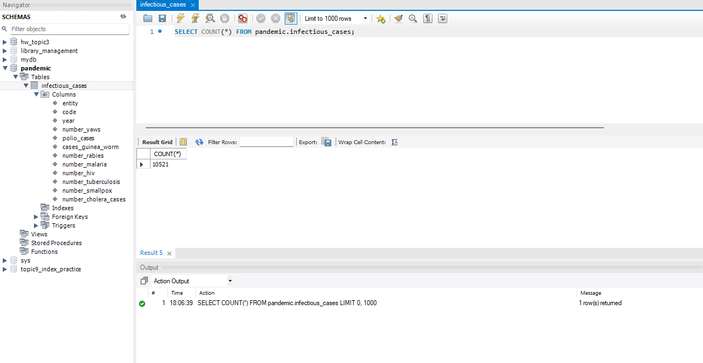

## 2. Нормалізуйте таблицю infectious_cases до 3ї нормальної форми. Збережіть у цій же схемі дві таблиці з нормалізованими даними.

Оскільки таблиця вже в 1й нормальній формі, то нам потрібно перейти до 2ї нормальної форми, а потім до 3ї нормальної форми.

### 2.1 Приведення до 2ї нормальної форми:

Відокремлюємо сутності `Entity` та `Code` в окрему таблицю `entities`:

```sql
CREATE TABLE entities (
    id INT AUTO_INCREMENT PRIMARY KEY,
    entity VARCHAR(255) NOT NULL,
    code VARCHAR(10) NULL,
    UNIQUE(entity)
);

-- Копіюємо країни та їх коди без повторень з основної таблиці
INSERT INTO entities (entity, code)
SELECT DISTINCT entity, code
FROM infectious_cases;
```

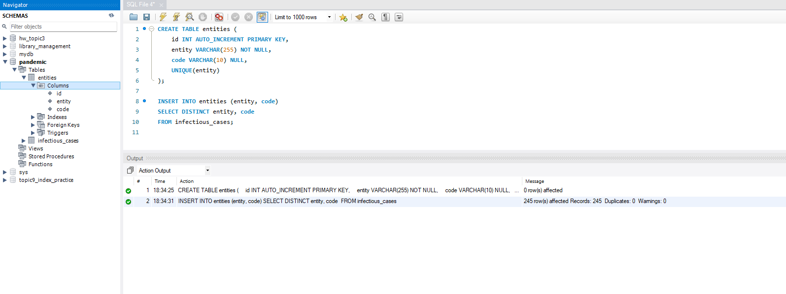

Також створюємо нову таблицю `infectious_cases_2nf`, яка міститиме посилання на `entity_id` з таблиці `entities`.

```sql
CREATE TABLE infectious_cases_2nf (
    id INT AUTO_INCREMENT PRIMARY KEY,
    entity_id INT NOT NULL,
    year YEAR NOT NULL,
    number_yaws INT NULL,
    polio_cases INT NULL,
    cases_guinea_worm INT NULL,
    number_rabies FLOAT NULL,
    number_malaria FLOAT NULL,
    number_hiv FLOAT NULL,
    number_tuberculosis FLOAT NULL,
    number_smallpox INT NULL,
    number_cholera_cases INT NULL,
    FOREIGN KEY (entity_id) REFERENCES entities(id)
);

-- Вставляємо дані до нової таблиці,
-- використовуючи JOIN для отримання entity_id з таблиці entities
INSERT INTO infectious_cases_2nf (
    entity_id, year, number_yaws, polio_cases, cases_guinea_worm,
    number_rabies, number_malaria, number_hiv, number_tuberculosis,
    number_smallpox, number_cholera_cases
)
SELECT
    e.id, i.year, i.number_yaws, i.polio_cases, i.cases_guinea_worm,
    i.number_rabies, i.number_malaria, i.number_hiv, i.number_tuberculosis,
    i.number_smallpox, i.number_cholera_cases
FROM infectious_cases i
JOIN entities e ON i.entity = e.entity;
```

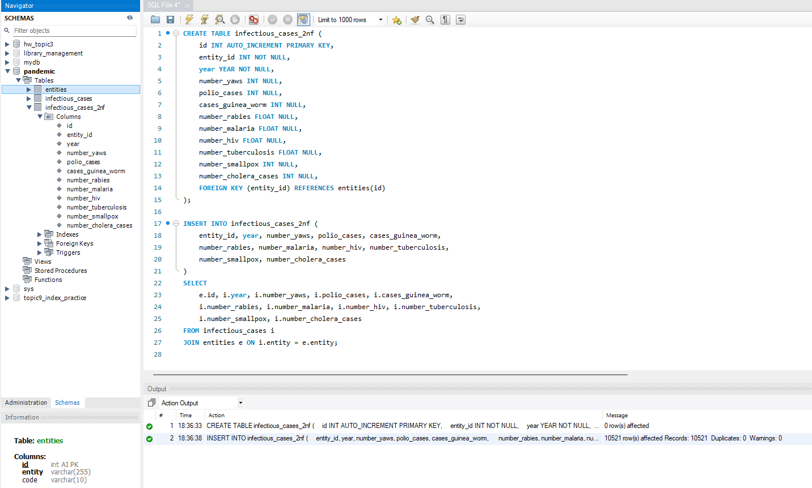

### 2.2 Приведення до 3ї нормальної форми:

Тепер для приведення до 3ї нормальної форми потрібно:

1. Відокремити колонки з хворобами в окрему таблицю `diseases`:

```sql
CREATE TABLE diseases (
    id INT AUTO_INCREMENT PRIMARY KEY,
    disease_name VARCHAR(255) NOT NULL,
    UNIQUE(disease_name)
);

-- Вставляємо усі назви хвороб до таблиці diseases
INSERT INTO diseases (disease_name) VALUES
('number_yaws'), ('polio_cases'), ('cases_guinea_worm'),
('number_rabies'), ('number_malaria'), ('number_hiv'),
('number_tuberculosis'), ('number_smallpox'), ('number_cholera_cases');
```

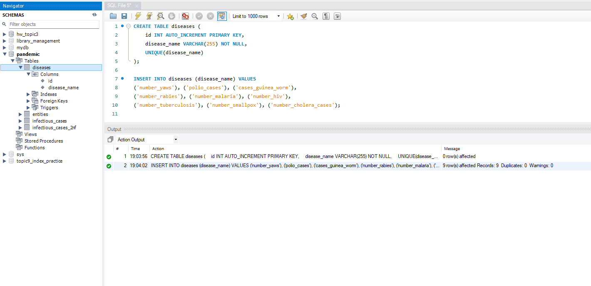

2. Тепер створюємо таблицю `infectious_cases_3nf` на базі `infectious_cases_2nf`, але без колонок з хворобами, та замість них створюємо колонку з посиланням на `disease`, та для додаємо нову колонку `case_count`, яка буде містити кількість випадків для відповідної хвороби:

```sql
CREATE TABLE infectious_cases_3nf (
    id INT AUTO_INCREMENT PRIMARY KEY,
    entity_id INT NOT NULL,
    disease_id INT NOT NULL,
    year YEAR NOT NULL,
    case_count FLOAT NULL,

    FOREIGN KEY (entity_id) REFERENCES entities(id),
    FOREIGN KEY (disease_id) REFERENCES diseases(id)
);
```

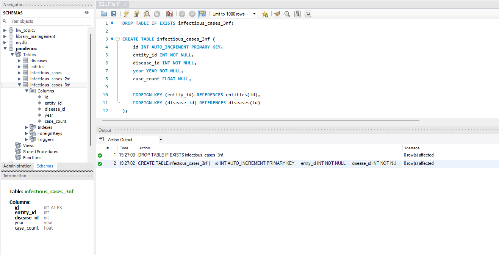

Та вставляємо дані до нової таблиці. Для кожної хвороби ми робимо окремий SELECT з
JOIN для отримання `entity_id` та `disease_id`, та об'єднуємо їх за допомогою
UNION ALL в одну таблицю:

```sql
-- Вставляємо дані до нової таблиці
INSERT INTO infectious_cases_3nf (entity_id, disease_id, year, case_count)
SELECT e.id, d.id, i.year, i.number_yaws
FROM infectious_cases i JOIN entities e ON i.entity = e.entity JOIN diseases d ON d.disease_name = 'number_yaws'
WHERE i.number_yaws IS NOT NULL
UNION ALL
SELECT e.id, d.id, i.year, i.polio_cases
FROM infectious_cases i JOIN entities e ON i.entity = e.entity JOIN diseases d ON d.disease_name = 'polio_cases'
WHERE i.polio_cases IS NOT NULL
UNION ALL
SELECT e.id, d.id, i.year, i.cases_guinea_worm
FROM infectious_cases i JOIN entities e ON i.entity = e.entity JOIN diseases d ON d.disease_name = 'cases_guinea_worm'
WHERE i.cases_guinea_worm IS NOT NULL
UNION ALL
SELECT e.id, d.id, i.year, i.number_rabies
FROM infectious_cases i JOIN entities e ON i.entity = e.entity JOIN diseases d ON d.disease_name = 'number_rabies'
WHERE i.number_rabies IS NOT NULL
UNION ALL
SELECT e.id, d.id, i.year, i.number_malaria
FROM infectious_cases i JOIN entities e ON i.entity = e.entity JOIN diseases d ON d.disease_name = 'number_malaria'
WHERE i.number_malaria IS NOT NULL
UNION ALL
SELECT e.id, d.id, i.year, i.number_hiv
FROM infectious_cases i JOIN entities e ON i.entity = e.entity JOIN diseases d ON d.disease_name = 'number_hiv'
WHERE i.number_hiv IS NOT NULL
UNION ALL
SELECT e.id, d.id, i.year, i.number_tuberculosis
FROM infectious_cases i JOIN entities e ON i.entity = e.entity JOIN diseases d ON d.disease_name = 'number_tuberculosis'
WHERE i.number_tuberculosis IS NOT NULL
UNION ALL
SELECT e.id, d.id, i.year, i.number_smallpox
FROM infectious_cases i JOIN entities e ON i.entity = e.entity JOIN diseases d ON d.disease_name = 'number_smallpox'
WHERE i.number_smallpox IS NOT NULL
UNION ALL
SELECT e.id, d.id, i.year, i.number_cholera_cases
FROM infectious_cases i JOIN entities e ON i.entity = e.entity JOIN diseases d ON d.disease_name = 'number_cholera_cases'
WHERE i.number_cholera_cases IS NOT NULL
```

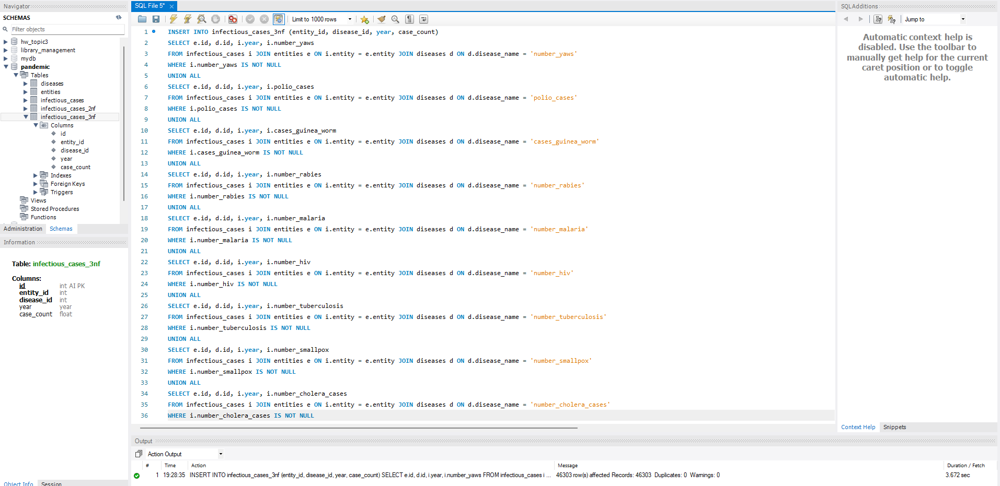

Кількість рядків у таблиці `infectious_cases_3nf` після вставки даних:

```sql
SELECT COUNT(*) FROM infectious_cases_3nf;
```

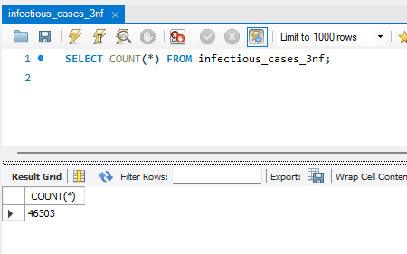

## 3. Проаналізуйте дані:

- Для кожної унікальної комбінації `Entity` та `Code` або їх `id` порахуйте середнє, мінімальне, максимальне значення та суму для атрибута `Number_rabies`.
- Результат відсортуйте за порахованим середнім значенням у порядку спадання.
- Оберіть тільки 10 рядків для виведення на екран.

```sql
SELECT
    -- Entity
    e.entity,
    -- Code
    e.code,
    -- Середнє
    AVG(d_data.case_count) AS avg_rabies,
    -- Мінімальне
    MIN(d_data.case_count) AS min_rabies,
    -- Максимальне
    MAX(d_data.case_count) AS max_rabies,
    -- Сума
    SUM(d_data.case_count) AS sum_rabies
FROM infectious_cases_3nf d_data
JOIN entities e ON d_data.entity_id = e.id
JOIN diseases d ON d_data.disease_id = d.id
WHERE d.disease_name = 'number_rabies'
-- Групуємо тільки за Entity, оскільки пара Entity та Code є унікальною
GROUP BY e.entity
-- Результат відсортуйте за порахованим середнім значенням у порядку спадання
ORDER BY avg_rabies DESC
-- Оберіть тільки 10 рядків для виведення на екран
LIMIT 10;
```

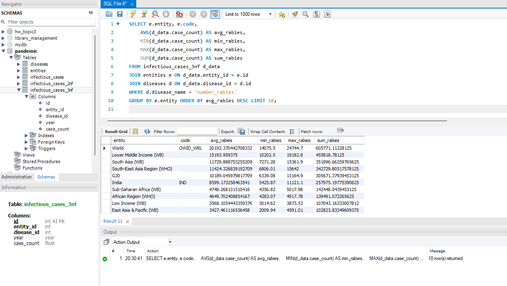

## 4. Побудуйте колонку різниці в роках.

- атрибут, що створює дату першого січня відповідного року,
- атрибут, що дорівнює поточній даті,
- атрибут, що дорівнює різниці в роках двох вищезгаданих колонок.

```sql
SELECT
    e.entity,
    d_data.year AS original_year,
    MAKEDATE(d_data.year, 1) AS start_of_year,
    CURDATE() AS today_date,
    TIMESTAMPDIFF(YEAR, MAKEDATE(d_data.year, 1), CURDATE()) AS year_difference
FROM infectious_cases_3nf d_data
JOIN entities e ON d_data.entity_id = e.id;
```

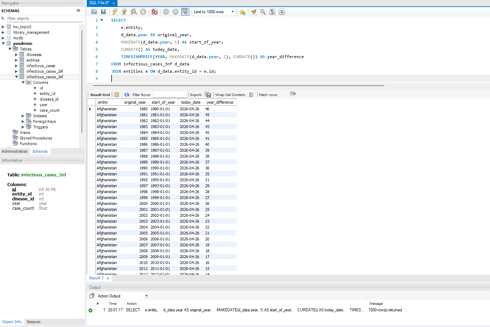

## 5. Створіть і використайте функцію, що будує такий же атрибут, як і в попередньому завданні: функція має приймати на вхід значення року, а повертати різницю в роках між поточною датою та датою, створеною з атрибута року (1996 рік → ‘1996-01-01’).

Створення функції:

```sql
DELIMITER //

CREATE FUNCTION GetYearDifference(input_year YEAR)
RETURNS INT
DETERMINISTIC
BEGIN
    DECLARE year_diff INT;
    SET year_diff = TIMESTAMPDIFF(YEAR, MAKEDATE(input_year, 1), CURDATE());
    RETURN year_diff;
END //

DELIMITER ;
```

Та використання:

```sql
SELECT
    e.entity,
    d_data.year,
    GetYearDifference(d_data.year) AS year_difference
FROM infectious_cases_3nf d_data
JOIN entities e ON d_data.entity_id = e.id;
```

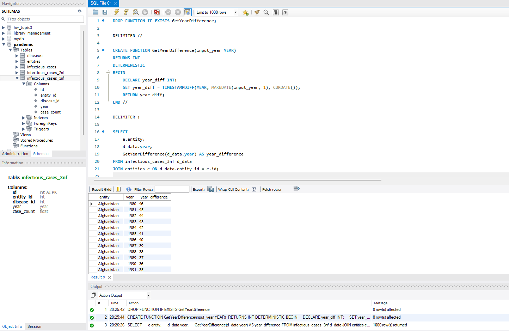
